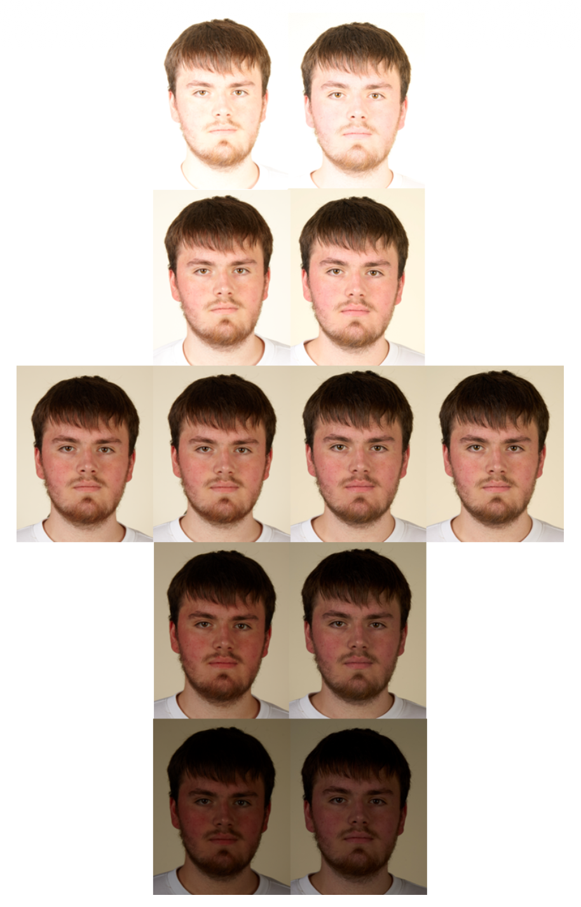

# DAST-SkinTone-database

The DArmstadt Skin Tone (DAST) database contains portrait images from a large variety of capture subjects (light skin to dark skin). Face images are captured under controlled conditions and include ICAO compliant samples as well as systematically overexposed and underexposed images for each subject. In addition, for each subject multiple ground truth measurements for the skin tone are included. The dataset is intended to support the evaluation of demographic bias in face image quality measures and to facilitate the development and benchmarking of skin tone classification.

<!-- # DAST -->
<h1 align="center"> DAST: DArmstadt Skin Tone Database</h1>
<p align="center">

  <p align="center">
    <a href="https://dasec.h-da.de/staff/christoph-busch/"><strong>Christoph Busch</strong></a>
    ,
    <a href="https://dasec.h-da.de/staff/fabian-stockhardt/"><strong>Fabian Stockhardt</strong></a>    
    ·
    <a href="https://dasec.h-da.de/staff/christian-rathgeb/"><strong>Christian Rathgeb</strong></a>    

  </p>
  <div align="center">
  </div>

Please contact Christian Rathgeb (christian.rathgeb@h-da.de) or Christoph Busch (christoph.busch@h-da.de) to receive the DAST database.

<p align="center"> 

</p>

## Citation 

If you use this work in your publication, please cite the following publications:

```
@inproceedings{Busch-DAST-IWBF-2026,
 Author = {C. Busch and P. Kibler and F. Stockhardt and C. Rathgeb},
 Booktitle = {14th Intl. Workshop on Biometrics and Forensics {IWBF}},
 Publisher = {IEEE},
 Title = {A Skin Tone Annotated Face Image Dataset for Studying Demographic Variability},
 Year = {2026}
}```

  <div align="center">
  </div>
## Example Data 

Example face images from the DAST database that can be used for publications can be found in the folder example-data.  
